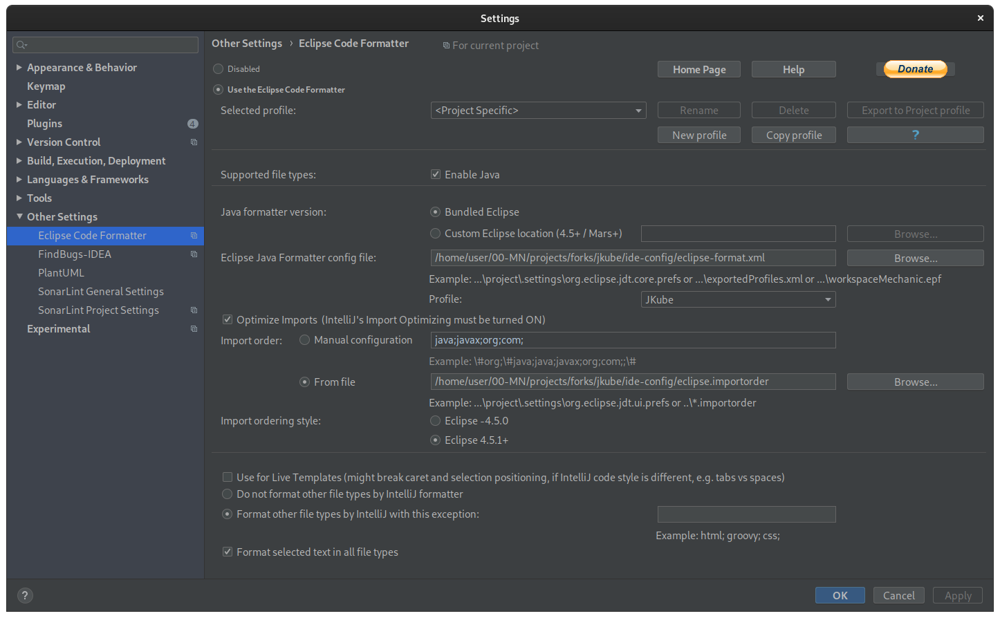

# Contributing guide

Thanks for being interested in contributing to Eclipse JKube!

## Want to contribute?

**Great!** We try to make it easy, and all contributions, even the smaller ones, are more than welcome.

This includes bug reports, fixes, documentation, examples... But first, please read this page.

### Legal

All original contributions to Eclipse JKube are licensed under the
[Eclipse Public License - v2.0](https://github.com/eclipse/jkube/blob/master/LICENSE).

The first step before submitting any pull request is singing an
[Eclipse Contributor Agreement](https://accounts.eclipse.org/user/eca). To complete this step you'll need
an [Eclipse account](https://accounts.eclipse.org/).

### Reporting an issue

Eclipse JKube uses [GitHub](https://github.com/eclipse/jkube/issues) to manage the issues.
Please [open](https://github.com/eclipse/jkube/issues/new) an issue directly in GitHub.

If you believe you found a bug (It's very likely you did), please open an issue
indicating a way to reproduce it, what you are seeing and what you are expecting to see.

If you want your issue to be resolved quickly, please include in your issue:
- Operating System
- Eclipse JKube version
- Java version
- Maven/Gradle version
- Target cluster version (Kubernetes, OpenShift, Minikube, CRC, etc.)

### Before you contribute

To contribute use GitHub [pull requests](https://github.com/eclipse/jkube/pulls) from your **own** fork.

All commits must be [signed-off](https://git-scm.com/docs/git-commit#Documentation/git-commit.txt---signoff)
by a user that has signed the
[Eclipse Contributor Agreement](https://www.eclipse.org/legal/ECA.php).

#### Code reviews

All reviews, including submissions by project members, need to be reviewed before being merged by the project official
[committers](https://projects.eclipse.org/projects/ecd.jkube/who).

#### Tests and documentation are not optional

Don't forget to include unit tests in your pull requests along with documentation (Reference information, javadoc, etc.).

### Project Setup

#### IDE Config and Code Style

Code formatting is done by the Eclipse code formatter using the configuration files found in the `ide-config` directory.

##### Eclipse IDE Setup

Open the Preferences window, and then navigate to Java -> Code Style -> Formatter.
Click Import and then select the `eclipse-format.xml` file in the `ide-config` directory.

Next navigate to Java -> Code Style -> Organize Imports.
Click Import and select the `eclipse.importorder` file in the `ide-config` directory.

##### IntelliJ IDEA Setup

Open the Preferences window (or Settings depending on your edition), navigate to Plugins and install the
[Eclipse Code Formatter Plugin](https://plugins.jetbrains.com/plugin/6546-eclipse-code-formatter) from the Marketplace.

Restart your IDE, open the Preferences (or Settings) window again and navigate to Other Settings -> Eclipse Code Formatter.

Select Use the Eclipse Code Formatter, then change the Eclipse Java Formatter Config File to point to the
`eclipse-format.xml` file in the `ide-config` directory.

Make sure the Optimize Imports box is ticked, and select the `eclipse.importorder` file as the import order config file.

