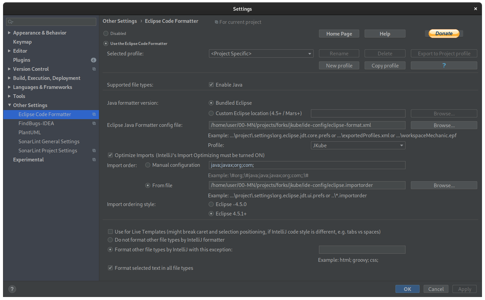

import {Hero} from '../../components'

<Hero>
# Contributing guide

Thanks for being interested in contributing to Eclipse JKube!
</Hero>

## Want to contribute?

**Great!** We try to make it easy, and all contributions, even the smaller ones, are more than welcome.

This includes bug reports, fixes, documentation, examples... But first, please read this page.

## Table of Contents
- [Legal](#legal)
- [Reporting an issue](#reporting-an-issue)
- [Get the Code](#get-the-code)
- [Before you contribute](#before-you-contribute)
  - [Trying out project as end user](#trying-out-project-as-end-user)
  - [Finding an issue to work on](#finding-an-issue-to-work-on)
    - [First Timers Only Issues](#first-timers-only-issues)
    - [Good First Issues](#good-first-issues)
    - [Help Wanted Issues](#help-wanted-issues)
- [Development Tools](#development-tools)
- [Project Setup](#project-setup)
  - [Building Project Locally](#building-project-locally)
  - [Testing Local Build](#testing-local-build)
  - [Debugging Plugins](#debugging-plugins)
  - [IDE Config and Code Style](#ide-config-and-code-style)
  - [GitPod](#gitpod)
  - [Eclipse IDE Setup](#eclipse-ide-setup)
  - [IntelliJ IDEA Setup](#intellij-idea-setup)
- [Working on Issue](#working-on-issue)
  - [Commit SignOff](#commit-signoff)
  - [Code reviews](#code-reviews)
  - [Tests and documentation are not optional](#test-and-documentation-are-not-optional)
- [Workflow Tips](#workflow-tips)
- [Documentation](#documentation)
  - [Building Documentation](#building-documentation)
- [Frequently Asked Questions](#frequently-asked-questions)

### Legal

All original contributions to Eclipse JKube are licensed under the
[Eclipse Public License - v2.0](https://github.com/eclipse-jkube/jkube/blob/master/LICENSE). You would need to complete
some legal steps before starting to contribute to the project.

1. Create an [Eclipse account](https://accounts.eclipse.org/)
2. Sign [Eclipse Contributor Agreement](https://accounts.eclipse.org/user/eca)

Configure your local git config to set correct email address and name. This is important step as ECA validation check
tries to infer contributor details via git commit:

```shell
git config user.name "Your Name"
git config user.email "your_email@example.com"
```

### Reporting an issue

Eclipse JKube uses [GitHub](https://github.com/eclipse-jkube/jkube/issues) to manage the issues.
Please [open](https://github.com/eclipse-jkube/jkube/issues/new) an issue directly in GitHub.

If you believe you found a bug (It's very likely you did), please open an issue
indicating a way to reproduce it, what you are seeing and what you are expecting to see.

If you want your issue to be resolved quickly, please include in your issue:
- Operating System
- Eclipse JKube version
- Java version
- Maven/Gradle version
- Target cluster version (Kubernetes, OpenShift, Minikube, CRC, etc.)

### Get The Code

Project's source code is available on [GitHub](https://github.com/eclipse-jkube/jkube). If you're interested in
contributing to the project, you need to [fork the project](https://github.com/eclipse-jkube/jkube/fork).

### Before you contribute

To contribute use GitHub [pull requests](https://github.com/eclipse-jkube/jkube/pulls) from your **own** fork.

All commits must be [signed-off](https://git-scm.com/docs/git-commit#Documentation/git-commit.txt---signoff)
by a user that has signed the
[Eclipse Contributor Agreement](https://www.eclipse.org/legal/ECA.php).

#### Trying out project as end user
Before contributing to any Open Source project, it's important to have basic understanding of what the project is about.
It is advised to try out the project as an end user. This project is a collection of Maven and Gradle plugins for [Kubernetes](https://kubernetes.io/)
and [Red Hat OpenShift](https://www.redhat.com/en/technologies/cloud-computing/openshift), it's advised to learn about these
technologies if you're interested in seriously contributing to the project.

You can read some blogs about project or watch videos on [Eclipse JKube YouTube channel](https://www.youtube.com/@jkube) .

#### Finding an issue to work on

You're free to start with any type of contribution, whether it is documentation or some issue you faced while
trying out the project. From time to time we create new issues tagged with label [`good first issue`](https://github.com/eclipse-jkube/jkube/issues?q=is%3Aissue+is%3Aopen+sort%3Aupdated-desc+label%3A%22good+first+issue%22) .

If you're contributing for the first time, we advise to start with a [`first timers only`](https://github.com/eclipse-jkube/jkube/issues?q=is%3Aissue+is%3Aopen+sort%3Aupdated-desc+label%3Afirst-timers-only) issues.

These issues are a great way to getting started with project. They are divided into three categories at the moment.

##### First Timers Only Issues
[`first timers only`](https://github.com/eclipse-jkube/jkube/issues?q=is%3Aissue+is%3Aopen+sort%3Aupdated-desc+label%3Afirst-timers-only) issues are usually one line changes that are created for contributors who are contributing to the project for the
first time. Even if you are quite skilled, please consider doing one issue of this category, to get used to the process (e.g PR creation workflow, ECA commit signoff requirement). After that, you
are invited to move on up to the more difficult tasks, leaving some of the easy tasks to others so they can get involved and achieve change
themselves.

These issues are aimed for first-time contributors to get acquainted with the project and the Eclipse Foundation contributing policies.
Users are only allowed to take one of these issues and are also encouraged to tackle one of these before doing more complex code contributions.
These issues are extremely simple to solve. In general, the code changes are already described in the issue.
The main purpose is to ensure that contributors have signed an ECA and are familiar with the GitHub pull request procedures.

##### Good First Issues
[`good first issue`](https://github.com/eclipse-jkube/jkube/issues?q=is%3Aissue+is%3Aopen+sort%3Aupdated-desc+label%3A%22good+first+issue%22) issues are slightly involved issues that are created for contributors that have already contributed to the project.
These issues are aimed for users who have already tackled a first-timers-only and would like to continue their contributing journey on the project.
These issues are slightly more complicated and will require actual work from the contributor.
The main purpose is for contributors to gain confidence while working on the code-base and to keep them engaged in the project.

##### Help Wanted Issues
[`help wanted`](https://github.com/eclipse-jkube/jkube/issues?q=is%3Aissue+is%3Aopen+sort%3Aupdated-desc+label%3A%22help+wanted%22) issues are more complex issues created to be picked by contributors familiar with codebase.

These issues are more complex and are aimed for regular contributors of the project or people who are familiar with the code-base.

#### Code reviews

All reviews, including submissions by project members, need to be reviewed before being merged by the project official
[committers](https://projects.eclipse.org/projects/ecd.jkube/who).

We usually require two approvals in order to merge a pull request. Project members usually review it within a week or two.
Feel free to notify them in case feedback is not provided on your pull request.


#### Tests and documentation are not optional

Don't forget to include unit tests in your pull requests along with documentation (Reference information, javadoc, etc.).

Please make sure you have verified project is compiling cleanly when you run existing tests as well:

```shell
mvn clean install
```

### Workflow Tips
- Please try to work on a single issue at a time.
- Please provide updates each week or so, otherwise someone else may take the issue.
- If an issue has an assignee without any update in a week, feel free to notify them that you're interested in working in that issue.
- If you realize you can't complete a task - please leave a comment on the issue and unassign yourself from the issue.

### Development Tools
In order to contribute code to the project, it is recommended to install these tools for smooth development experience:
- [Apache Maven](https://maven.apache.org/)
- A Java IDE ([IntelliJ](https://www.jetbrains.com/idea/) / [Eclipse](https://eclipseide.org/))
- Container tools ([Docker](https://www.docker.com/) / [Podman](https://podman.io/))
- [Minikube](https://minikube.sigs.k8s.io/)

### Project Setup

#### Building Project Locally

In order to build the project, you would require to install these first:
- Install Java SDK 11+ ([OpenJDK](https://adoptium.net/) recommended)
- Install [Apache Maven](https://maven.apache.org/)

Once you've set these tools, you can compile the project using maven.

In order to build project quickly by skipping tests, use this command:
```shell
mvn clean install -DskipTests
```

In order to perform complete build by running all unit and integration tests, use this command:
```shell
mvn clean install
```

After the build is successful, the artifacts should be available in your local Maven repository `$HOME/.m2`.

#### Testing Local Build

In order to try out local build, you can build the project and use the `SNAPSHOT` version in one of the quickstarts.

For example, if project version is `x.yz-SNAPSHOT`, you can go to any quickstart in `quickstarts/` directory and change
plugin version used in quickstart project to use the development version.


**With Maven**
```shell
mvn clean install -DskipTests

# Testing Kubernetes Maven Plugin in quickstarts/maven
cd quickstarts/maven/spring-boot
mvn k8s:resource -Djkube.version=x.yz-SNAPSHOT -Pkubernetes
```

**With Gradle**
```shell
# Testing Kubernetes Gradle Plugin in quickstarts/gradle
cd quickstarts/gradle/spring-boot
# Edit build.gradle to change Kubernetes Gradle Plugin version to 'x.yz-SNAPSHOT'
./gradlew k8sResource
```

#### Debugging Plugins

##### Maven
In order to debug Kubernetes Maven Plugin, use `mvnDebug` instead of `mvn` to start debug process:
```shell
mvnDebug k8s:resource
Preparing to execute Maven in debug mode
Listening for transport dt_socket at address: 8000
```

After starting this session, you would need to connect to this process from your IDE via remote JVM debugging configuration.

##### Gradle
In order to debug Kubernetes Gradle Plugin, use
```shell
./gradlew -Dorg.gradle.debug=true k8sResource
```
After starting this session, you would need to connect to this process from your IDE via remote JVM debugging configuration.

#### GitPod

You can also use [Gitpod](https://gitpod.io) to contribute without install anything on your computer. Click [here](https://gitpod.io/#https://github.com/eclipse/jkube) to start a workspace.

#### IDE Config and Code Style

Code formatting is done by the Eclipse code formatter using the configuration files found in the `ide-config` directory.

##### Eclipse IDE Setup

Open the Preferences window, and then navigate to Java -> Code Style -> Formatter.
Click Import and then select the `eclipse-format.xml` file in the `ide-config` directory.

Next navigate to Java -> Code Style -> Organize Imports.
Click Import and select the `eclipse.importorder` file in the `ide-config` directory.

##### IntelliJ IDEA Setup

Open the Preferences window (or Settings depending on your edition), navigate to Plugins and install the
[Eclipse Code Formatter Plugin](https://plugins.jetbrains.com/plugin/6546-eclipse-code-formatter) from the Marketplace.

Restart your IDE, open the Preferences (or Settings) window again and navigate to Other Settings -> Eclipse Code Formatter.

Select Use the Eclipse Code Formatter, then change the Eclipse Java Formatter Config File to point to the
`eclipse-format.xml` file in the `ide-config` directory.

Make sure the Optimize Imports box is ticked, and select the `eclipse.importorder` file as the import order config file.



### Working on Issue

While working on issue, please try to align your changes with existing coding conventions. Here are some examples:

- When adding a new file, please don't forget to add the license header via `mvn -N license:format`
- Please configure your IDE to not add wildcard imports, we don't use wildcard imports.
- Please make sure you have verified that project compiles cleanly after running `mvn clean install -DskipTests` (skips tests) and `mvn clean install` (runs all tests).
- Please properly squash your pull requests before submitting them.

#### Commit SignOff

Commits should be atomic and semantic. We use [Conventional Commits](https://www.conventionalcommits.org/en/v1.0.0/).

Please make sure you have added the `Signed-off-by:` footer in your git commit. In order to do it automatically, use the `--signoff` flag:

```shell
git commit --signoff
```

With this command, git would automatically add a footer by reading your name and email from git config.

### Documentation

Documentation for Maven/Gradle plugins is available at [Eclipse JKube Website](https://eclipse.dev/jkube/docs/) .

- Documentation for JKube core is present in [jkube-kit/doc](https://github.com/eclipse-jkube/jkube/tree/master/jkube-kit/doc)
- Maven Plugins related documentation is present in [kubernetes-maven-plugin/doc](https://github.com/eclipse-jkube/jkube/tree/master/kubernetes-maven-plugin/doc)
- Gradle Plugins related documentation is present in [gradle-plugin/doc](https://github.com/eclipse-jkube/jkube/tree/master/gradle-plugin/doc)

We convert AsciiDoc to HTML using [AsciiDoc Maven Plugin](https://docs.asciidoctor.org/maven-tools/latest/plugin/introduction/).

In order to generate documentation for a single module, run this command:
```shell
mvn -Phtml package
# Check Generated Documentation (Open in Browser)
ls target/generated-docs/index.html
target/generated-docs/index.html
```
We also have a bash script to generate documentation for all plugins together. You can use it like this:

```shell
sh scripts/generateDoc.sh
# Check Generated Documentation (Open in Browser)
ls docs-generated/index.html
```

### Frequently Asked Questions

- **Not able to compile project on Windows. Is there any workaround for this?**

Our existing test suite is not fully compatible with Windows. Check the [issue for test failures on Windows](https://github.com/eclipse-jkube/jkube/issues/1338).
In order to work around this, you can use `-DskipTests` flag to skip running tests while compiling project using `mvn clean install`. With this workaround, you should
be able to load the project in your IDE.